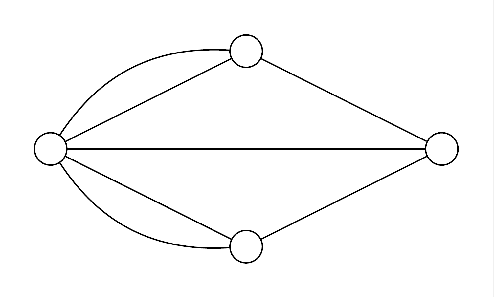

## Welcome to SevenBridges

SevenBridges is a Python library for adjacency matrix calculation. The main goal of this project is to provide a simple and flexible framework for creating the adjacency matrices necessary for implicit graphs for graph neural networks (GNNs) or Graph Signal Processing. 

You can use SevenBridges for calculating the adjacency matrix based on geographical locations of the nodes, or by examining the actual time series values in a dataset. 

SevenBridges implements the most popular techniques for graph construction, including:

## Current Implemented Techniques
- MinMax 
- Kmeans
## Future Implemented Techniques
- Optics
- KNN (Weighted)
- Correlation (based on time series data)
- Dynamic Time Warping
- Mutual Information Coefficient
- Relative Neighborhood 
- Gabriel

## Installation
SevenBridges is compatible with python 3.8 and above.
The simplest way to install SevenBridges is from PyPi:

```
pip install sevenbridges
```

## Requirements
* pandas
* matplotlib
* networkx
* numpy
* scikit-learn
* scipy

## Contributing
SevenBridges is an open-source project available on Github, and contributions of all types are welcome. Feel free to open a pull request if you have something interesting that you want to add to the framework.